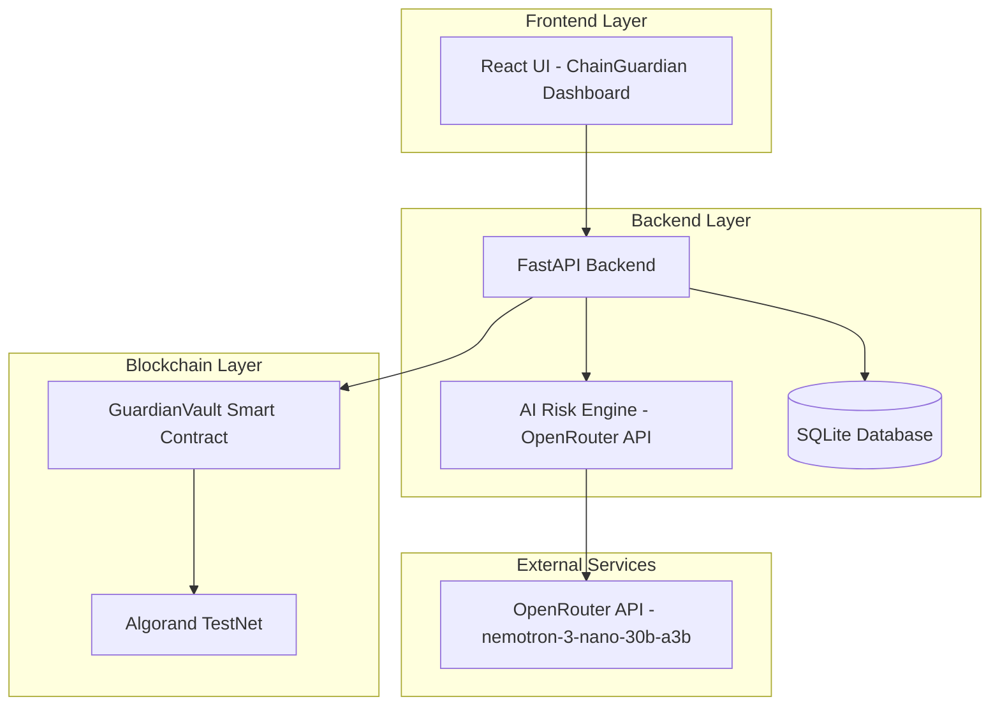
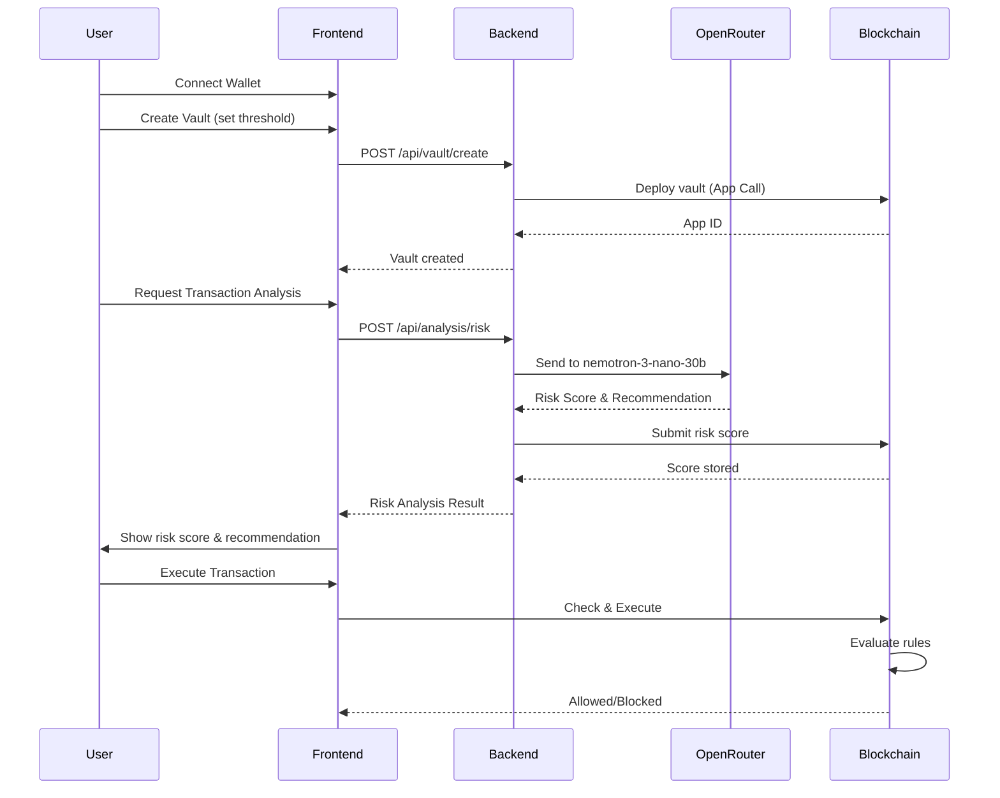

# ChainGuardian Implementation Plan
## AI-Powered DeFi Risk & Compliance Assistant on Algorand

---

## 1. Architecture Overview



---

## 2. File Structure

```
neural-trust/
├── plans/
│   └── chainguardian-plan.md (this file)
├── projects/
│   ├── contracts/
│   │   ├── smart_contracts/
│   │   │   ├── guardian_vault/
│   │   │   │   ├── contract.py
│   │   │   │   ├── deploy_config.py
│   │   │   │   └── README.md
│   │   │   ├── counter/
│   │   │   └── bank/
│   │   ├── artifacts/
│   │   └── tests/
│   ├── frontend/
│   │   ├── src/
│   │   │   ├── components/
│   │   │   │   ├── ConnectWallet.tsx
│   │   │   │   ├── GuardianVault.tsx
│   │   │   │   ├── RiskDashboard.tsx
│   │   │   │   ├── AIAnalysisPanel.tsx
│   │   │   │   ├── VaultList.tsx
│   │   │   │   ├── TransactionHistory.tsx
│   │   │   │   └── AuditLog.tsx
│   │   │   ├── services/
│   │   │   │   ├── api.ts
│   │   │   │   ├── aiEngine.ts
│   │   │   │   └── blockchain.ts
│   │   │   ├── hooks/
│   │   │   │   ├── useGuardianVault.ts
│   │   │   │   ├── useAIAnalysis.ts
│   │   │   │   └── useRiskScore.ts
│   │   │   ├── types/
│   │   │   │   └── index.ts
│   │   │   └── contracts/
│   │   │       └── GuardianVault.ts
│   │   └── package.json
│   └── backend/
│       ├── app/
│       │   ├── main.py
│       │   ├── api/
│       │   │   ├── routes/
│       │   │   │   ├── vault.py
│       │   │   │   ├── analysis.py
│       │   │   │   └── audit.py
│       │   │   └── dependencies.py
│       │   ├── services/
│       │   │   ├── ai_engine.py
│       │   │   ├── blockchain_service.py
│       │   │   ├── vault_manager.py
│       │   │   └── audit_service.py
│       │   ├── models/
│       │   │   ├── schemas.py
│       │   │   └── database.py
│       │   └── config.py
│       ├── requirements.txt
│       └── pyproject.toml
```

---

## 3. Implementation Phases

### Phase 1: Smart Contract Development
**Status**: [ ]

| Task | Description | File |
|------|-------------|------|
| 3.1.1 | Design GuardianVault contract structure | `projects/contracts/smart_contracts/guardian_vault/contract.py` |
| 3.1.2 | Implement risk score storage | Storage: `risk_score`, `threshold`, `is_frozen` |
| 3.1.3 | Implement AI authorization | Authorize AI address for score updates |
| 3.1.4 | Implement enforcement logic | Block transactions based on risk rules |
| 3.1.5 | Implement freeze functionality | Emergency freeze by owner/AI |
| 3.1.6 | Implement audit logging | Immutable decision logging |
| 3.1.7 | Write unit tests | `projects/contracts/tests/guardian_vault_test.py` |
| 3.1.8 | Deploy to TestNet | Via AlgoKit deploy |

### Phase 2: Backend Development
**Status**: [ ]

| Task | Description | File |
|------|-------------|------|
| 3.2.1 | Create FastAPI project structure | `projects/backend/` |
| 3.2.2 | Configure OpenRouter API client | `projects/backend/app/services/ai_engine.py` |
| 3.2.3 | Implement AI Risk Engine | nemotron-3-nano-30b-a3b integration |
| 3.2.4 | Implement vault management APIs | `projects/backend/app/api/routes/vault.py` |
| 3.2.5 | Implement blockchain service | `projects/backend/app/services/blockchain_service.py` |
| 3.2.6 | Implement audit logging | `projects/backend/app/services/audit_service.py` |
| 3.2.7 | Set up SQLite database | `projects/backend/app/models/database.py` |
| 3.2.8 | Write API endpoints | `/analyze-risk`, `/create-vault`, `/execute-action`, `/freeze`, `/audit` |

### Phase 3: Frontend Development
**Status**: [ ]

| Task | Description | File |
|------|-------------|------|
| 3.3.1 | Create GuardianVault TypeScript client | `projects/frontend/src/contracts/GuardianVault.ts` |
| 3.3.2 | Build Risk Dashboard UI | `projects/frontend/src/components/RiskDashboard.tsx` |
| 3.3.3 | Build Vault Creation UI | `projects/frontend/src/components/GuardianVault.tsx` |
| 3.3.4 | Build AI Analysis Panel | `projects/frontend/src/components/AIAnalysisPanel.tsx` |
| 3.3.5 | Build Audit Log Viewer | `projects/frontend/src/components/AuditLog.tsx` |
| 3.3.6 | Implement API service layer | `projects/frontend/src/services/api.ts` |
| 3.3.7 | Create custom hooks | `projects/frontend/src/hooks/` |
| 3.3.8 | Integrate wallet with GuardianVault | Connect existing wallet to new contract |

### Phase 4: Integration & Testing
**Status**: [ ]

| Task | Description |
|------|-------------|
| 3.4.1 | End-to-end workflow testing |
| 3.4.2 | AI analysis verification |
| 3.4.3 | Blockchain enforcement testing |
| 3.4.4 | UI/UX refinement |
| 3.4.5 | Performance optimization |

---

## 4. Smart Contract: GuardianVault

### 4.1 Contract Structure

```python
from algopy import *
from algopy.arc4 import abimethod

class GuardianVault(ARC4Contract):
    """Smart contract for AI-powered DeFi risk management"""
    
    # State variables
    owner: Address
    ai_authorizer: Address  # Authorized AI service address
    risk_threshold: UInt64  # Default threshold (e.g., 70)
    vaults: BoxMap(Address, UInt64)  # User vault mapping
    risk_scores: BoxMap(Address, UInt64)  # Stored risk scores
    is_frozen: BoxMap(Address, Bool)  # Frozen status per vault
    audit_log: BoxMap(UInt64, (Address, UInt64, String, UInt64))  # Decision log
    
    def __init__(self) -> None:
        """Initialize contract"""
        self.vaults = BoxMap(Address, UInt64, key_prefix="")
        self.risk_scores = BoxMap(Address, UInt64, key_prefix="")
        self.is_frozen = BoxMap(Address, Bool, key_prefix="")
        self.audit_log = BoxMap(UInt64, (Address, UInt64, String, UInt64), key_prefix="")
```

### 4.2 Key Methods

```python
@abimethod()
def create_vault(self, risk_threshold: UInt64) -> UInt64:
    """Create a new guardian vault for the sender"""
    assert self.vaults.maybe(Txn.sender) is None, "Vault already exists"
    self.vaults[Txn.sender] = risk_threshold
    self.risk_scores[Txn.sender] = UInt64(0)
    self.is_frozen[Txn.sender] = Bool(False)
    return UInt64(1)  # Success

@abimethod()
def update_risk_score(self, user: Address, score: UInt64) -> Bool:
    """AI-authorized method to update risk score"""
    assert Txn.sender == self.ai_authorizer, "Only authorized AI can update scores"
    assert self.vaults.maybe(user) is not None, "Vault does not exist"
    self.risk_scores[user] = score
    return Bool(True)

@abimethod()
def check_and_execute(self, action_type: String) -> Bool:
    """Check risk score and allow/block action"""
    assert self.vaults.maybe(Txn.sender) is not None, "No vault found"
    assert not self.is_frozen[Txn.sender], "Vault is frozen"
    
    threshold = self.vaults[Txn.sender]
    current_score = self.risk_scores[Txn.sender]
    
    # Risk evaluation
    if current_score > threshold:
        # High risk - block and log
        self._log_decision(Txn.sender, current_score, "BLOCKED", UInt64(0))
        return Bool(False)
    
    # Low/medium risk - allow
    self._log_decision(Txn.sender, current_score, "ALLOWED", UInt64(1))
    return Bool(True)

@abimethod()
def freeze_vault(self, user: Address) -> Bool:
    """Emergency freeze by owner or AI"""
    assert Txn.sender == self.owner or Txn.sender == self.ai_authorizer
    self.is_frozen[user] = Bool(True)
    return Bool(True)

@abimethod()
def unfreeze_vault(self, user: Address) -> Bool:
    """Unfreeze by owner"""
    assert Txn.sender == self.owner
    self.is_frozen[user] = Bool(False)
    return Bool(True)
```

---

## 5. AI Risk Engine: OpenRouter Integration

### 5.1 Configuration

```python
# projects/backend/app/config.py
from pydantic_settings import BaseSettings

class Settings(BaseSettings):
    OPENROUTER_API_KEY: str
    OPENROUTER_BASE_URL: str = "https://openrouter.ai/api/v1"
    AI_MODEL: str = "neuralbase/nemotron-3-nano-30b-a3b:free"
    ALGORAND_NETWORK: str = "testnet"
    CONTRACT_APP_ID: int
    
    class Config:
        env_file = ".env"
```

### 5.2 AI Engine Implementation

```python
# projects/backend/app/services/ai_engine.py
import httpx
from app.config import settings

class AIRiskEngine:
    """AI-powered risk analysis using OpenRouter"""
    
    def __init__(self):
        self.api_key = settings.OPENROUTER_API_KEY
        self.model = settings.AI_MODEL
        self.base_url = settings.OPENROUTER_BASE_URL
    
    async def analyze_transaction(self, transaction_data: dict) -> dict:
        """Analyze a transaction and return risk score"""
        
        prompt = f"""
        Analyze this DeFi transaction for risk:
        
        Transaction Details:
        - Type: {transaction_data.get('type', 'unknown')}
        - Amount: {transaction_data.get('amount', '0')} ALGO
        - Recipient: {transaction_data.get('recipient', 'unknown')}
        - Timestamp: {transaction_data.get('timestamp', 'unknown')}
        
        Consider:
        1. Is this a suspicious pattern?
        2. Could this be a scam attempt?
        3. Is the amount unusually large?
        4. Is this a new/unknown address?
        
        Return a JSON object with:
        - risk_score (0-100): 0=safe, 100=extremely risky
        - recommendation: "ALLOW", "WARN", or "BLOCK"
        - reasoning: brief explanation
        """
        
        async with httpx.AsyncClient() as client:
            response = await client.post(
                f"{self.base_url}/chat/completions",
                headers={
                    "Authorization": f"Bearer {self.api_key}",
                    "Content-Type": "application/json",
                },
                json={
                    "model": self.model,
                    "messages": [
                        {"role": "system", "content": "You are a DeFi security analyst. Always respond with valid JSON."},
                        {"role": "user", "content": prompt}
                    ],
                    "max_tokens": 500,
                    "temperature": 0.3
                }
            )
            
            result = response.json()
            content = result["choices"][0]["message"]["content"]
            
            # Parse JSON from response
            import json
            analysis = json.loads(content)
            
            return {
                "risk_score": min(100, max(0, analysis.get("risk_score", 50))),
                "recommendation": analysis.get("recommendation", "WARN"),
                "reasoning": analysis.get("reasoning", "Analysis complete"),
                "model_used": self.model
            }
```

---

## 6. Backend API Endpoints

### 6.1 API Routes

```python
# projects/backend/app/api/routes/vault.py
from fastapi import APIRouter, Depends
from app.models.schemas import VaultCreate, VaultResponse

router = APIRouter(prefix="/api/vault", tags=["vault"])

@router.post("/create")
async def create_vault(request: VaultCreate):
    """Create a new Guardian Vault"""
    # Implementation in vault_manager.py
    pass

@router.get("/{address}")
async def get_vault(address: str):
    """Get vault details for an address"""
    pass

@router.post("/freeze")
async def freeze_vault(address: str, reason: str):
    """Freeze a vault"""
    pass
```

### 6.2 Analysis Routes

```python
# projects/backend/app/api/routes/analysis.py
from fastapi import APIRouter

router = APIRouter(prefix="/api/analysis", tags=["analysis"])

@router.post("/risk")
async def analyze_risk(transaction_data: dict):
    """Analyze transaction risk using AI"""
    engine = AIRiskEngine()
    return await engine.analyze_transaction(transaction_data)

@router.post("/batch")
async def batch_analyze(transactions: list[dict]):
    """Analyze multiple transactions"""
    pass
```

---

## 7. Frontend Components

### 7.1 Type Definitions

```typescript
// projects/frontend/src/types/index.ts
export interface Vault {
  owner: string;
  riskThreshold: number;
  currentRiskScore: number;
  isFrozen: boolean;
  createdAt: number;
}

export interface RiskAnalysis {
  riskScore: number;
  recommendation: 'ALLOW' | 'WARN' | 'BLOCK';
  reasoning: string;
  modelUsed: string;
}

export interface AuditLog {
  id: number;
  address: string;
  riskScore: number;
  decision: string;
  timestamp: number;
}
```

### 7.2 API Service

```typescript
// projects/frontend/src/services/api.ts
const API_BASE = import.meta.env.VITE_API_URL || 'http://localhost:8000';

export const api = {
  async analyzeRisk(transaction: any): Promise<RiskAnalysis> {
    const response = await fetch(`${API_BASE}/api/analysis/risk`, {
      method: 'POST',
      headers: { 'Content-Type': 'application/json' },
      body: JSON.stringify(transaction),
    });
    return response.json();
  },

  async createVault(threshold: number): Promise<Vault> {
    const response = await fetch(`${API_BASE}/api/vault/create`, {
      method: 'POST',
      headers: { 'Content-Type': 'application/json' },
      body: JSON.stringify({ threshold }),
    });
    return response.json();
  },

  async getAuditLog(address: string): Promise<AuditLog[]> {
    const response = await fetch(`${API_BASE}/api/audit/${address}`);
    return response.json();
  },
};
```

---

## 8. Workflow Diagram



---

## 9. What You Need to Do

### Prerequisites
1. [ ] Get OpenRouter API key from https://openrouter.ai/
2. [ ] Configure TestNet account with ALGO funds
3. [ ] Install dependencies: `algokit project bootstrap all`

### Files to Create/Modify

| Component | Action | Files |
|-----------|--------|-------|
| Smart Contract | Create | `projects/contracts/smart_contracts/guardian_vault/` |
| Backend | Create | `projects/backend/` (FastAPI) |
| Frontend Components | Create | 6 new components in `projects/frontend/src/components/` |
| API Client | Create | `projects/frontend/src/services/api.ts` |
| Hooks | Create | `projects/frontend/src/hooks/` |
| Types | Create | `projects/frontend/src/types/index.ts` |

### Environment Variables

```bash
# .env (backend)
OPENROUTER_API_KEY=your_key_here
CONTRACT_APP_ID=your_deployed_app_id
ALGORAND_NETWORK=testnet

# .env.localnet (frontend)
VITE_API_URL=http://localhost:8000
VITE_CONTRACT_APP_ID=your_deployed_app_id
```

---

## 10. Security Considerations

1. **AI Authorization**: Only authorized AI address can update risk scores on-chain
2. **Owner Controls**: Contract owner can freeze vaults in emergencies
3. **Immutable Audit**: All decisions logged on-chain
4. **User Control**: Users can set their own risk thresholds
5. **No Asset Access**: AI never has direct access to user assets

---

## 11. Next Steps

1. ✅ Approve this plan
2. ⬜ Start Phase 1: Smart Contract Development
3. ⬜ Phase 2: Backend Development
4. ⬜ Phase 3: Frontend Development
5. ⬜ Phase 4: Integration & Testing
